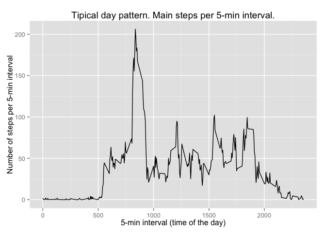
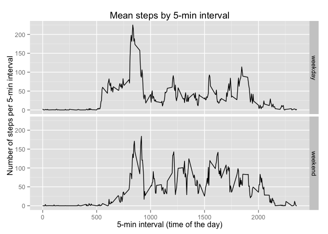

# Reproducible Research: Peer Assessment 1


```r
options("scipen" = 100, "digits" = 4)
```


## Loading and preprocessing the data

The file `activity.zip` should be in the working directory. Please, certify that this file is in your current **working directory**.


```r
unzip("activity.zip", overwrite = FALSE)
dat.raw <- read.csv("activity.csv", 
                    colClasses = c("integer", "character", "integer"))
str(dat.raw)
```

```
## 'data.frame':	17568 obs. of  3 variables:
##  $ steps   : int  NA NA NA NA NA NA NA NA NA NA ...
##  $ date    : chr  "2012-10-01" "2012-10-01" "2012-10-01" "2012-10-01" ...
##  $ interval: int  0 5 10 15 20 25 30 35 40 45 ...
```

We will make use of the `data.table` package. You should certify that you have this package installed.

To use the `data.table` package, we must transform the `data.frame` dataset into a `data.table` format.


```r
library(data.table)
data.tbl <- data.table(dat.raw)
```


## What is mean total number of steps taken per day?

### Dataset for the histogram
First we create a dataset that will help us plot the histogram and calculate the mean and median steps per day.


```r
sum_by_day <- data.tbl[ , .(sum.day = sum(steps, na.rm = TRUE)), by = date]
```

We can see that there are some days that no steps were recorded, indicating that a problem may have occurred with the data collection system. Let us take a look at some selected lines of this dataset:


```r
sum_by_day[c(1:5, 34:40, 50:61)]
```

```
##           date sum.day
##  1: 2012-10-01       0
##  2: 2012-10-02     126
##  3: 2012-10-03   11352
##  4: 2012-10-04   12116
##  5: 2012-10-05   13294
##  6: 2012-11-03   10571
##  7: 2012-11-04       0
##  8: 2012-11-05   10439
##  9: 2012-11-06    8334
## 10: 2012-11-07   12883
## 11: 2012-11-08    3219
## 12: 2012-11-09       0
## 13: 2012-11-19    8841
## 14: 2012-11-20    4472
## 15: 2012-11-21   12787
## 16: 2012-11-22   20427
## 17: 2012-11-23   21194
## 18: 2012-11-24   14478
## 19: 2012-11-25   11834
## 20: 2012-11-26   11162
## 21: 2012-11-27   13646
## 22: 2012-11-28   10183
## 23: 2012-11-29    7047
## 24: 2012-11-30       0
##           date sum.day
```

### Histogram

To plot the histogram, we will use the `ggvis` package. Please, make sure that you have the `ggvis` package installed.

Considering only those days where the number of steps recorded was greater than zero, we obtain the following histogram of the distribution of steps per day.


```r
library(ggvis)
sum_by_day[sum.day > 0] %>% ggvis(~sum.day) %>% 
        layer_histograms(width = 2000, boundary = 0) %>% 
        add_axis("x", title = "Total steps per day") %>% 
        add_axis("x", orient = "top", ticks = 0, 
                 title = "Histogram of the distribution of total steps per day",
                 properties = axis_props(axis = list(stroke = "white"),
                                         labels = list(fontSize = 0)))
```

<!--html_preserve--><div id="plot_id696067032-container" class="ggvis-output-container">
<div id="plot_id696067032" class="ggvis-output"></div>
<div class="plot-gear-icon">
<nav class="ggvis-control">
<a class="ggvis-dropdown-toggle" title="Controls" onclick="return false;"></a>
<ul class="ggvis-dropdown">
<li>
Renderer: 
<a id="plot_id696067032_renderer_svg" class="ggvis-renderer-button" onclick="return false;" data-plot-id="plot_id696067032" data-renderer="svg">SVG</a>
 | 
<a id="plot_id696067032_renderer_canvas" class="ggvis-renderer-button" onclick="return false;" data-plot-id="plot_id696067032" data-renderer="canvas">Canvas</a>
</li>
<li>
<a id="plot_id696067032_download" class="ggvis-download" data-plot-id="plot_id696067032">Download</a>
</li>
</ul>
</nav>
</div>
</div>
<script type="text/javascript">
var plot_id696067032_spec = {
  "data": [
    {
      "name": ".0/bin1/stack2",
      "format": {
        "type": "csv",
        "parse": {
          "xmin_": "number",
          "xmax_": "number",
          "stack_upr_": "number",
          "stack_lwr_": "number"
        }
      },
      "values": "\"xmin_\",\"xmax_\",\"stack_upr_\",\"stack_lwr_\"\n0,2000,2,0\n2000,4000,2,0\n4000,6000,3,0\n6000,8000,3,0\n8000,10000,7,0\n10000,12000,16,0\n12000,14000,10,0\n14000,16000,7,0\n16000,18000,1,0\n18000,20000,0,0\n20000,22000,2,0"
    },
    {
      "name": "scale/x",
      "format": {
        "type": "csv",
        "parse": {
          "domain": "number"
        }
      },
      "values": "\"domain\"\n-1100\n23100"
    },
    {
      "name": "scale/y",
      "format": {
        "type": "csv",
        "parse": {
          "domain": "number"
        }
      },
      "values": "\"domain\"\n0\n16.8"
    }
  ],
  "scales": [
    {
      "name": "x",
      "domain": {
        "data": "scale/x",
        "field": "data.domain"
      },
      "zero": false,
      "nice": false,
      "clamp": false,
      "range": "width"
    },
    {
      "name": "y",
      "domain": {
        "data": "scale/y",
        "field": "data.domain"
      },
      "zero": false,
      "nice": false,
      "clamp": false,
      "range": "height"
    }
  ],
  "marks": [
    {
      "type": "rect",
      "properties": {
        "update": {
          "stroke": {
            "value": "#000000"
          },
          "fill": {
            "value": "#333333"
          },
          "x": {
            "scale": "x",
            "field": "data.xmin_"
          },
          "x2": {
            "scale": "x",
            "field": "data.xmax_"
          },
          "y": {
            "scale": "y",
            "field": "data.stack_upr_"
          },
          "y2": {
            "scale": "y",
            "field": "data.stack_lwr_"
          }
        },
        "ggvis": {
          "data": {
            "value": ".0/bin1/stack2"
          }
        }
      },
      "from": {
        "data": ".0/bin1/stack2"
      }
    }
  ],
  "legends": [],
  "axes": [
    {
      "type": "x",
      "scale": "x",
      "orient": "bottom",
      "title": "Total steps per day",
      "layer": "back",
      "grid": true
    },
    {
      "type": "x",
      "scale": "x",
      "orient": "top",
      "title": "Histogram of the distribution of total steps per day",
      "ticks": 0,
      "layer": "back",
      "grid": true,
      "properties": {
        "labels": {
          "fontSize": {
            "value": 0
          }
        },
        "axis": {
          "stroke": {
            "value": "white"
          }
        }
      }
    },
    {
      "type": "y",
      "scale": "y",
      "orient": "left",
      "layer": "back",
      "grid": true,
      "title": "count"
    }
  ],
  "padding": null,
  "ggvis_opts": {
    "keep_aspect": false,
    "resizable": true,
    "padding": {},
    "duration": 250,
    "renderer": "svg",
    "hover_duration": 0,
    "width": 672,
    "height": 480
  },
  "handlers": null
};
ggvis.getPlot("plot_id696067032").parseSpec(plot_id696067032_spec);
</script><!--/html_preserve-->

### Mean and median steps per day

To calculate the mean and median steps per day, we consider only those days with positive records of steps.


```r
mm.steps <- sum_by_day[sum.day > 0, .(mean = mean(sum.day), median = median(sum.day))]
```

The mean steps per day is **10766** and the median is **10765**.


## What is the average daily activity pattern?
### Dataset of mean steps per 5-minute interval

The functionalities of `data.table` help us in determining the average steps, aggregated by corresponding time intervals.


```r
mean_by_interval <- data.tbl[ , .(meanSteps = mean(steps, na.rm = TRUE)), by = interval]
```


### Time series plot

The following plot shows the average steps per 5-minutes interval pattern throughout the day, averaged across all days. Observations with missing value for steps were excluded.  

Here, we can interpret the x axis either as each 5-minute interval or as the actual time of the day. To exemplify, the value labeled **500** in the x axis is the time **05:00**, or five in the morning (*am*); **1500** is equivalent to **03:00** in the afternoon (*pm*) and **1555** corresponds to **03:55** *pm*.


```r
library(ggplot2)
qplot(interval, meanSteps, data = mean_by_interval, geom = "line",
      main = "Tipical day pattern. Main steps per 5-min interval.",
      xlab = "5-min interval (time of the day)",
      ylab = "Number of steps per 5-min interval")
```

 

### Maximum 5-minute interval
The 5-minute interval that contains the maximum number of steps, averaged across all days in the dataset is the following:


```r
max.mean <- mean_by_interval[meanSteps == max(mean_by_interval$meanSteps)]
max.mean
```

```
##    interval meanSteps
## 1:      835     206.2
```

It means that, on average, 835 is the 5-minute time interval of a given day that this person walks the most.

## Imputing missing values
### Total number of NAs

```r
count.na <- is.na(dat.raw$steps)
total.na <- sum(count.na)
```

The total number of NAs in the dataset is **2304**.

### Imputation of NAs values

First, we have to bear in mind that the NAs are mostly a whole day of data that were not collected, instead of alternate NAs among complete observations. If our situation were the last one, we could use the average of the adjacent previous and subsequent interval.  

Using the fact that 24 hours comprehend 288 5-minute intervals, we adopted the following strategy. For those cases in the head of the dataset, NAs were replaced by the average of the corresponding 5-minute intervals of five subsequent days, ignoring possible NAs.  

For observations in the middle of the dataset, NAs were replaced by the average of the corresponding time intervals of two previous and two subsequent days, ignoring possible NAs.  

Finally, for observations in the tail of the dataset, NAs were replaced by the average of the corresponding 5-minute intervals of five previous days, ignoring possible NAs.


```r
dat.complete <- dat.raw

for(i in 1:length(dat.raw$steps)) {
        if(is.na(dat.raw$steps[i])) {
                if((i - 288) < 0) {
                        dat.complete$steps[i] <- mean(c(dat.raw$steps[i + 288],
                                                        dat.raw$steps[i + 2 * 288],
                                                        dat.raw$steps[i + 3 * 288],
                                                        dat.raw$steps[i + 4 * 288],
                                                        dat.raw$steps[i + 5 * 288]),
                                                      na.rm = TRUE)
                } else if((i + 288) > length(dat.raw$steps)) {
                        dat.complete$steps[i] <- mean(c(dat.raw$steps[i - 288],
                                                        dat.raw$steps[i - 2 * 288],
                                                        dat.raw$steps[i - 3 * 288],
                                                        dat.raw$steps[i - 4 * 288],
                                                        dat.raw$steps[i - 5 * 288]),
                                                      na.rm = TRUE)
                } else {
                        dat.complete$steps[i] <- mean(c(dat.raw$steps[i - 288],
                                                        dat.raw$steps[i - 2 * 288],
                                                        dat.raw$steps[i + 288],
                                                        dat.raw$steps[i + 2 * 288]),
                                                      na.rm = TRUE)
                }
        } else {next()}
}
```

To certify that there is no more NA left in our dataset, we do the following.


```r
sum(is.na(dat.complete$steps))
```

```
## [1] 0
```

We see that there is indeed no more NA in our dataset, since this result is zero.


## Are there differences in activity patterns between weekdays and weekends?
### Adjusting the dataset

```r
dat.complete.tbl <- data.table(dat.complete)
dat.complete.tbl[ , weekday := weekdays(as.POSIXlt(date))]

my.test <- dat.complete.tbl$weekday == "Saturday" | dat.complete.tbl$weekday == "Sunday"

dat.complete.tbl[my.test, "is.weekend"] <- "weekend"
dat.complete.tbl[!my.test, "is.weekend"] <- "weekday"

dat.complete.tbl[date == "2012-10-12"][1]
dat.complete.tbl[date == "2012-10-13"][1]
dat.complete.tbl[date == "2012-10-14"][1]
dat.complete.tbl[date == "2012-10-15"][1]
```

```
##        steps       date interval weekday
##     1:   9.4 2012-10-01        0  Monday
##     2:   0.0 2012-10-01        5  Monday
##     3:   0.0 2012-10-01       10  Monday
##     4:   0.0 2012-10-01       15  Monday
##     5:   0.0 2012-10-01       20  Monday
##    ---                                  
## 17564:  35.2 2012-11-30     2335  Friday
## 17565:  18.8 2012-11-30     2340  Friday
## 17566:   5.2 2012-11-30     2345  Friday
## 17567:   0.0 2012-11-30     2350  Friday
## 17568:   0.0 2012-11-30     2355  Friday
##    steps       date interval weekday is.weekend
## 1:     0 2012-10-12        0  Friday    weekday
##    steps       date interval  weekday is.weekend
## 1:     0 2012-10-13        0 Saturday    weekend
##    steps       date interval weekday is.weekend
## 1:     0 2012-10-14        0  Sunday    weekend
##    steps       date interval weekday is.weekend
## 1:     0 2012-10-15        0  Monday    weekday
```

### Ploting the series by weekday/weekend

By using the `data.table` functionalities, we can easily calculate the average steps per 5-minute interval, broken by time interval and day of the week (whether is weekend or not).  

The following panel shows the average steps per 5-minutes interval patterns throughout the day, aggregated by weekday. Here, we can interpret the x axis either as each 5-minute interval or as the actual time of the day. To exemplify, the value labeled **500** in the x axis is the time **05:00**, or five in the morning (*am*); **1500** is equivalent to **03:00** in the afternoon (*pm*).


```r
dat.compWeek <- dat.complete.tbl[ , .(mean.weeks = mean(steps)),
                                  by = .(interval, is.weekend)]
qplot(interval, mean.weeks, data = dat.compWeek, 
      facets = is.weekend~., geom = "line", main = "Mean steps by 5-min interval",
      xlab = "5-min interval (time of the day)",
      ylab = "Number of steps per 5-min interval")
```

 


